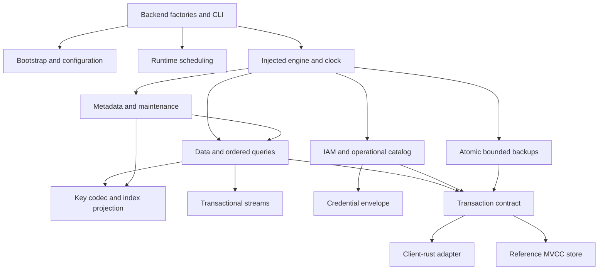

# TiKV storage design

TiKV fits ExtendDB's key-oriented data model, but replacing PostgreSQL means
implementing the catalog, indexes, transactions and change log as well as item
storage. `extenddb-storage-tikv` implements the existing storage and catalog
traits without adding TiKV dependencies to the core or operation handlers.

## Module dependency direction

The transport layer exposes owned transactions with get, snapshot get, bounded
scan, buffered writes, commit and rollback. No TiKV types escape its adapter.
The engine accepts an `Arc<dyn Store>` and an optional `Arc<dyn Clock>`, which
makes retries, interleavings, retention and expiry testable without a server.
Only the `client` feature links client-rust. The reference store is confined to
unit tests or the explicit `test-support` feature.

## Keys and equality

All keys begin with the escaped tuple `(extenddb, namespace, v1)`. NUL escaping
and component terminators preserve byte order without delimiter collisions.
Strings use UTF-8 bytes, binary attributes use their already decoded raw bytes,
and decimals use canonical arbitrary-precision order encoding. `2`, `2.0` and
`2E0` address the same numeric key. No conversion through floating point occurs.

Table names map to immutable UUIDs inside an account. Base items use the table ID
and its complete primary key. Index keys append the full base primary key after
the index key; duplicate index keys remain independently addressable and forward
and reverse cursors are exact inverses. Sparse index entries are omitted. LSI
reads fetch the base image so the shared engine can implement selection of
non-projected attributes; GSI reads retain their stored projection.

## Transactions and schema changes

The client uses optimistic two-phase commit. Reads in a writing transaction
protect existing and absent keys. Lock dependencies are deferred until commit;
read-only operations retain their snapshot and create no lock-only writes.
Only structural, confirmed conflicts replay a closure. There are at most 64
attempts, with full jitter and a maximum 256 ms backoff between attempts. Every
attempt recomputes conditions from a new snapshot. Unknown commit results are
returned without automatic replay. Request cancellation schedules rollback;
process-crash recovery also relies on TiKV lock expiry.

A single protected table metadata key would serialize unrelated item writes,
because optimistic read locks themselves produce MVCC write versions. Instead,
each table has 256 guard slots. A mutation snapshot-reads metadata and protects a
slot chosen from its complete item key. Schema changes update all slots and the
metadata generation atomically. A pre-change writer cannot commit afterward;
ordinary item writes usually use different slots. Pure metadata/statistics
changes that do not affect data semantics do not advance the generation.

Before starting a write transaction, the engine acquires fair process-local
admission slots for its item keys, in sorted order for multi-item writes. This
prevents one server from flooding TiKV with stale transactions on a hot item.
It is a contention optimization; TiKV remains the source of cross-process
correctness.

The reference store models these lock-only write versions, rather than offering
stronger concurrency than the real adapter. A dedicated test stages independent
writes concurrently and then stages another write across a schema change to
verify rejection. Scans do not claim predicate locks: table/account lifecycle
invariants use explicit guard records where absence of children matters.

Item changes, secondary index updates, TTL entries, stream records and transaction
idempotency tokens commit together. Failed multi-operation requests roll back
all mutations. Idempotency is scoped by account generation and token, and token
replay checks the original request fingerprint within the ten-minute window.

## Catalog and credentials

IAM is a per-account aggregate containing principals, memberships, policies,
boundaries, tags and sessions. This keeps relationship invariants within one
transaction. A 4 MiB encoded cap fails before any mutation is staged. This is an
explicit scale tradeoff for IAM, not the data-plane storage layout.

Access-key locators map globally unique IDs to owners. Locator changes and the
aggregate update share a transaction; duplicate IDs cannot attach the same key
to two accounts. AES-256-GCM binds ciphertext to the access-key ID using AAD.
There is no unauthenticated fallback, and cached encryption-key buffers are
zeroized. Credential lookup reads locator and owner in one snapshot and checks
session expiry. Bcrypt work occurs outside the async executor.

Account generations prevent retained streams, backups or idempotency tokens from
being inherited when an administrator reuses a deleted account ID. The shared
authorization interface identifies role sessions by role/name, so live sessions
with the same name must have the same tags/policy; conflicting profiles require
a different session name.

Settings/admin records are independent documents. Metrics merge sums, counts,
minimums and maximums by their dimensions and bucket. Login failures are
append-only. Retention scans use persisted cursors and bounded transactions.

## Maintenance and streams

Online GSI creation first publishes building metadata. Writers maintain the
building index while a worker copies existing items in batches of 64, advancing
a persisted cursor in the same commit. Reading each source item protects against
resurrecting an index entry after concurrent mutation. Pre-existing values that
violate the new index's key definition are skipped; future writes are validated.
The index becomes readable only after backfill reaches the end.

TTL uses a distinct generation whenever enabled or changed. Backfill and writes
use identical entry construction. The deletion worker rechecks the current
attribute and timestamp transactionally, so extending a TTL cannot race into an
incorrect deletion. Expirations older than five years are ignored. TTL deletes
produce normal transactional REMOVE records with service identity.

Streams have 16 logical shards per generation. A counter and its record commit
with the item change, so a reader cannot skip an uncommitted lower sequence.
Counters are deliberate contention points. Disabled/deleted table generations
retain readable records for retention; wrong-account/unknown iterators are
rejected without disclosing shard existence. This is an application change log,
not a TiKV CDC consumer.

Maintenance exposes explicit single-step methods and uses the injected clock.
The runtime module schedules those methods and returns worker handles for
shutdown. Table deletion removes 64 physical keys per transaction and up to 16
batches per table/tick; name reuse follows physical cleanup. Retention handles
256 entries per pass and persists progress so live early keys cannot starve
later expired entries.

## Vector search

Vector metadata, validation, projections and backfill use the shared vector
lifecycle contracts. The TiKV-specific modules separate deterministic scoring,
transactional maintenance and the resumable build driver. Search takes one MVCC
snapshot, scans the selected partition in bounded pages and retains only TopK
hits. It supports Euclidean distance, cosine distance and dot product, hash
partitions, inline equality filters and the standard projections. This is exact
search with linear partition scan cost; it does not implement ANN acceleration.

Writers maintain vector rows in the same transaction as base items. Online
builds persist a cursor with each batch of at most 64 source rows, protect those
source reads against concurrent writes, and publish ACTIVE only at end of scan.
Index UUIDs prevent a deleted/recreated index from inheriting a stale worker.
Snapshot scans do not accumulate write-lock dependencies for read-only search.

The vector contracts run on the reference store and real TiKV, covering paging,
concurrent item mutation during backfill, restart, stale workers, account
isolation and backup restoration. Raw signed HTTP tests exercise all three
metrics through the normal server. The follow-on vector check passed all 42
TiKV unit/contracts and 15 vector HTTP checks locally.

## Backup, deployment and validation boundaries

On-demand backup takes one transactional snapshot, capped at 4 MiB encoded.
Restore atomically publishes a fresh table generation and rebuilt indexes.
Larger snapshots fail before any backup is published. Large-table export needs
a pinned timestamp with coordinated GC; this implementation does not pretend
that independent scan transactions provide a consistent snapshot. PITR is refused explicitly.

The TiDB Rust reference was read at commit
`6a5b492097d5be084a0b1106da2c7f106c518498`, including
`rust/crates/tidb-txnkv/src/driver/tikv_opener.rs` and `retry.rs`. Its injectable
transaction source and structural retry classification informed this boundary.
The published `tikv-client = 0.4.0` is pinned here because the reference fork
requires Rust 1.93, while ExtendDB retains MSRV 1.88. Replacing the adapter with
the fork does not require changing domain modules.

See the [module/test matrix](../../crates/storage-tikv/README.md) and
[setup guide](../local-tikv-setup.md) for reproducible checks. Local contracts and
SDK checks validate semantics, not production availability. Production rollout
still requires workload benchmarks, coordinated MVCC GC, multi-node fault and
partition tests, and a migration/rollback plan for existing PostgreSQL data.

## Recorded validation (2026-10-02)

The local checks used macOS arm64, PD/TiKV 8.5.5 and Python 3.12. Each SDK
invocation initialized an isolated namespace, served HTTPS with normal IAM,
passed `verify`, and destroyed that namespace after stopping the server.

| Check | Result |
|---|---|
| Existing Rust workspace tests | Passed; existing ignored tests remained ignored |
| TiKV unit and contract tests, with `--include-ignored` | 30 passed, including real data, IAM and lifecycle contracts |
| TiKV binary defaults test | Passed; loopback and TLS preserved |
| Core SDK, transactions, isolation, Streams, TTL, paging and multipart GSI | 413 passed, 1 existing expected failure |
| Concurrency, IAM/ABAC, GSI metadata, scoped idempotency and metrics | 116 passed; includes 50,000 parallel inserts and hot-item updates |
| Final query/index/key-validation regression after fixes | 149 passed (overlaps the preceding suites) |
| Rust 1.88.0, locked TiKV binary check | Passed |
| Strict Clippy for TiKV modules and binary, formatting | Passed |
| Mixed-backend and TiKV + dev-mode negative compilation checks | Both rejected as intended |
| New/updated Rust dependency licenses | 45 checked; all satisfy the repository's approved list |

The SDK suites emit warnings because the existing tests disable certificate
verification for local self-signed HTTPS. The GitHub Actions workflow provisions
its own PD/TiKV cluster and runs the same contracts and SDK paths; this validation
record describes local execution, not a completed hosted CI run. Multi-node
fault injection, long-running GC and production performance remain unvalidated.
